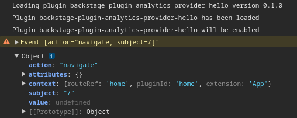

# Hello Analytics Plugin!

This is a very simple analytics plugin aimed to show it working in Red Hat Developer Hub (RHDH) as a dynamic plugin. It simply does print the events in console:



## Analytics Plugins

Analytics plugins are registered as an API, hence in Backstage configuration they registered simply in `apis.ts` by modifying the array `AnyApiFactory` to include an implementation of the method `captureEvent(event: AnalyticsEvent)`. 

In Backstage you need to modify this code, but in RHDH you can do this by using dynamic plugins.

## Analytics Plugins as Dynamic Plugin

Dynamic Plugins makes it possible to extend Red Hat Developer Hub without having to recompile Backstage. Considering that you have dynamic plugin in place, these are the steps to install this as a dynamic plugin in RHDH:

* Make the package available for RHDH. Check [Dynamic Plugins documentation](https://docs.redhat.com/en/documentation/red_hat_developer_hub/1.2/html/configuring_plugins_in_red_hat_developer_hub/rhdh-installing-dynamic-plugins) for more information;
* Configure the package in `app-config.yaml`. For Analytics Plugin it is required to inform the `importName`:

```
dynamicPlugins:
  frontend:
    backstage-plugin-analytics-provider-hello:
      apiFactories:
        - importName: HelloAnalyticsApi
```
